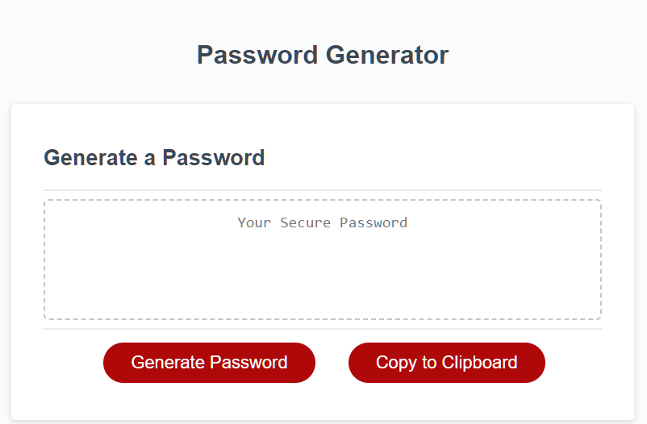
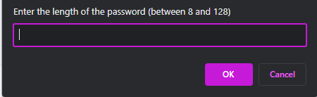

#  Password Generator  #
---

---

# Function
This is a simple web application for generating random passwords with different criteria, including password length, special characters, uppercase and lowercase letters.

# How to Use #
---
---
>* Open the web page of the password generator. (either right click, open preiview in VS Code or follow my GitHub page link *** )
>* Click on the "**Generate**" button.
>* Enter the desired password length in the prompt.
>* Choose whether or not to include special characters, uppercase letters and lowercase letters by answering the confirm prompts.
>* Click "**Generate Password**" to create the password.
>* Click "**Copy Password**" to copy the password to the clipboard.

----
---

<i>    * dont mind my purple theme, yours will differ based on your machines settings * </i>

# Technologies Used #
This password generator was built with HTML, CSS, and JavaScript.

# License
This project is licensed under the MIT License

# Acknowledgements
The copy password to clipboard isntuctions was modified from https://www.freecodecamp.org/news/copy-text-to-clipboard-javascript/
This uses newer **async** function vs outdated **execCommand** 
